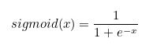
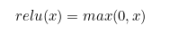

# Questions related to Neural Networks built for NLP Applications

The following questions are prepared primarily from he teachings of `deeplearning.ai coursera specialization`:

 
1. What is the advantage of <code>relu</code> over <code>sigmoid</code> activation function in neural network?

 
Ans: Relu can help in faster gradient descent compared to sigmoid. Relu does NOT have the expensive **exponential function** to compute like that of sigmoid
Also, gradient of sigmoid is atmost 0.25. So if there are many layers in NN, you will multiply these gradients, and the product of many smaller than 1 values goes to zero very quickly (vanishing gradient).     
 

**Some facts:**   
  
  
- sigmoid value ranges from `0 to 1` (when x tends to minus infinity, denominator becomes too huge, hence value will be close to 0)  
- As x increases, sigmoid(x) tends to 1 and derivative of sigmoid(x) tends to 0 (the gradient of sigmoids becomes increasingly small as the absolute value of x increases.)  
.png)  
.png)  
 
- relu value ranges from 0 to no upper limit!  
- gradient of relu is always a constant (because derivative of x over x is 1). Hence multiplying gradients will not explode it. The constant gradient of ReLUs results in faster learning.  
- But dying relu is a problem. if too many activations get below zero then most of the units(neurons) in network with Relu will simply output zero, in other words, die and thereby prohibiting learning.(This can be handled, to some extent, by using Leaky-Relu instead.)  
P.S
 

- Refer [here](https://stats.stackexchange.com/questions/126238/what-are-the-advantages-of-relu-over-sigmoid-function-in-deep-neural-networks) for detailed discussion
- (to create math equations like above use [this link](http://mathurl.com/)) 
 
 
 

 
2. Why is hyperbolic tangent (<code>tanh</code>) preferred more than sigmoid activation function in NN? 

 
 
   
 
 - tanh function has larger derivatives and this (somehow?) helps in minimizing cost function faster  
 - the outputs using tanh centre around 0 rather than sigmoid's 0.5, and this "makes learning for the next layer a little bit easier".  
 
 reference [here](https://stats.stackexchange.com/questions/330559/why-is-tanh-almost-always-better-than-sigmoid-as-an-activation-function)
 

 
 
 
3. What are the differences between <code>L1</code> and <code>L2</code> regularization techniques? When do we use <code>dropout</code> ?

 
 - All 3 techiques lead to simpler NNs. Hence, more `generalizable`  
 - `cost_function` = `Loss` + `Regularization`  
 - Regularization:  
 `L2` (Ridge) Regularization:  
 
   
 `L1` (Lasso) Regularization:  
 
   
 
> From a practical standpoint, L1 tends to shrink coefficients to zero whereas L2 tends to shrink coefficients evenly. L1 is therefore useful for **feature selection**, as we can drop any variables associated with coefficients that go to zero. L2, on the other hand, is useful when you have collinear/codependent features. (An example pair of codependent features is `gender` and `ispregnant` since only females can be `ispregnant`.)

  
 
> `Dropout` also simplifies NNs and is the most frequently used regularization technique in the field of deep learning (because it yields better results)
 
 
> The probability of choosing how many nodes should be dropped is the hyperparameter of the dropout function.
 
Sources:   
- https://explained.ai/regularization/L1vsL2.html  
- https://www.analyticsvidhya.com/blog/2018/04/fundamentals-deep-learning-regularization-techniques/
 
 
 

 
 
 
4. What are some of the typical set of <code>hyperparameters</code> tuned in a NN?

 
 - #hidden layers
 - #hidden units in each layer
 - #iterations (or epoch size)
 - #mini-batch size
 - choice of activation fn (e.g.: relu, tanh, etc.,)
 - choice of optimizer (e.g.: sgd, asgd, rmsprop,momentum, adam, etc.,)
 - learning rate
 - choice of regularization techniques
 
 

 
 
 
5. What are the different <code>text representation models</code> employed in NLP?

 
TL;DR version from Source [1]
 - I) Categorical word representation (e.g.: One-hot Encoding/ Bag of words)   
 - II) Weighted Word representation (e.g.: TF-IDF)  
 (both I and II suffer from the curse of high dimensionality; dimension length = vocab length)  
 - III) Representation Learning (trained based on a Self-supervised Learning technique like Language Model)  
     - a. Distributed Representations (e.g.: Word2Vec, FastText, GloVe)  
     - b. Contextual Embeddings (before Transformer) (e.g.: ULMFiT, ELMo, Context2Vector, USE made from Deep Averaging Networks)  
     - c. Transformer-based Pre-trained Language Models (not exhaustive)  
         - Universal Sentence Encoder (version made from Transformer Encoder)     
         - GPT1, 2 and 3 (OpenAI Transformer)  
			      - Bidirectional Encoder Representations from Transformers (BERT)  
			      - XLNet  
			      - ALBERT  
			      - RoBERTa  
			      - StructBERT  
			      - DistillBERT  
			      - MegatronLM  
			      - Ernie and Ernie 2.0  
			      - BART  
         - T5 (Text2Text Transfer Transformer)  

Source: 
 - [1] A Comprehensive Survey on Word Representation Models: From Classical to State-Of-The-Art Word Representation Language Models https://arxiv.org/pdf/2010.15036v1.pdf  
 - Evolution of Transfer Learning in Natural Language Processing Paper: https://arxiv.org/pdf/1910.07370.pdf

 

 
 
  

 
 
 
6. Why adding more layers is better than adding more neurons in a single layer in NN?

 
 
[1] Yoshua Bengio Explanation  
> Adding a layer increases the depth, and allows the network to represent more complex, more non-linear functions, *which might otherwise not be representable efficiently by a less deep network*
 
[2] NNs with many layers perform significantly better than NNs with a single layer (of equal no. of parameters) because of more non-linearity in the NN with many layers
 
 Source: 
 - [1] https://www.quora.com/What-is-a-difference-between-adding-one-more-layer-and-increasing-neurons-in-one-layer
 - https://www.quora.com/Why-do-neural-networks-with-more-layers-perform-better-than-a-single-layer-MLP-with-a-number-of-neurons-that-leads-to-the-same-number-of-parameters
  

